# Natural Language YouTube Search

Use [OpenAI's CLIP](https://openai.com/blog/clip/) neural network to search inside YouTube videos. You can try it by running the [notebook](https://colab.research.google.com/github/haltakov/natural-language-youtube-search/blob/main/natural-language-youtube-search.ipynb) on Google Colab.

## How it works

1. Download the YouTube video
2. Extract every N-th frame
3. Encode all frames using CLIP
4. Encode a natural language search query using CLIP
5. Find the images that best match the search query

For more details see the [notebook](https://colab.research.google.com/github/haltakov/natural-language-youtube-search/blob/main/natural-language-youtube-search.ipynb).

## Examples

Here are some example searches from this [YouTube video](https://www.youtube.com/watch?v=PGMu_Z89Ao8) of a car driving around San Francisco.

### "A fire truck"

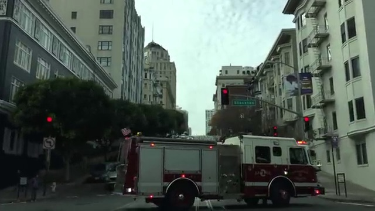
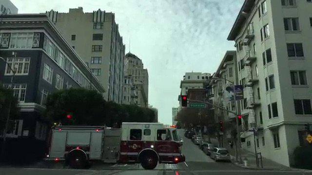
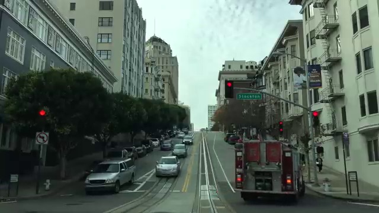

### "Road works"

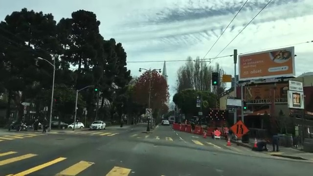
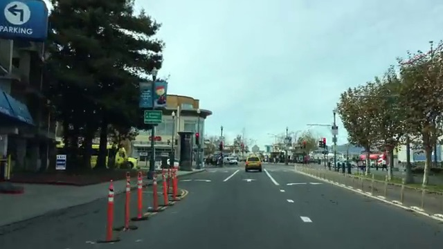

### "People crossing the street"

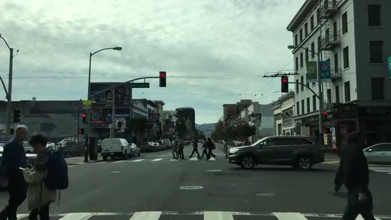
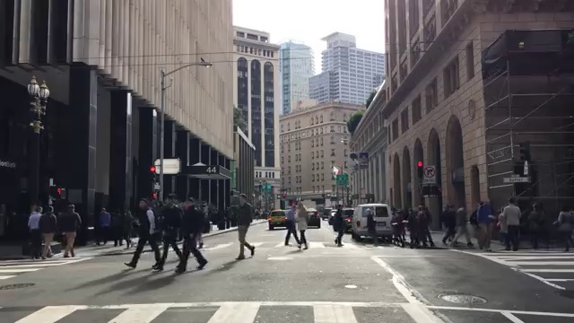
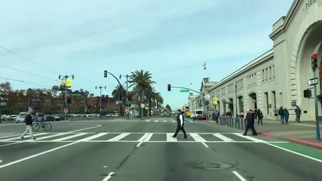

### "The Embarcadero"

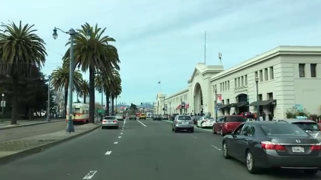

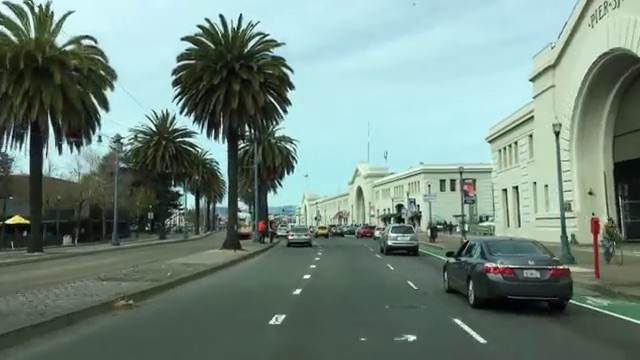

### "Waiting at the red light"

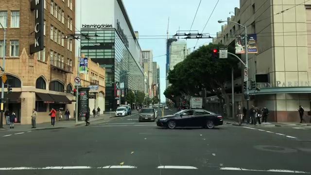
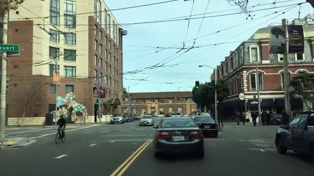
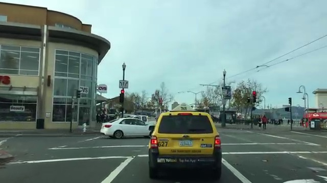

### "Green bike lane"

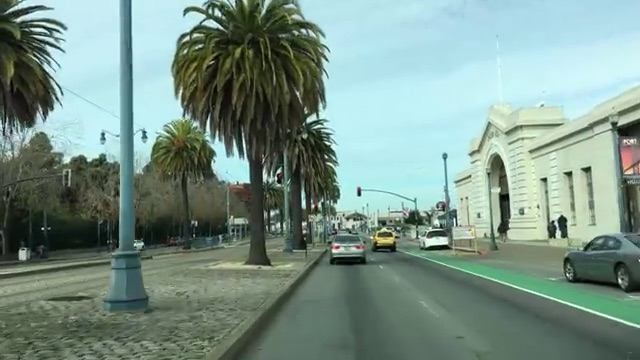
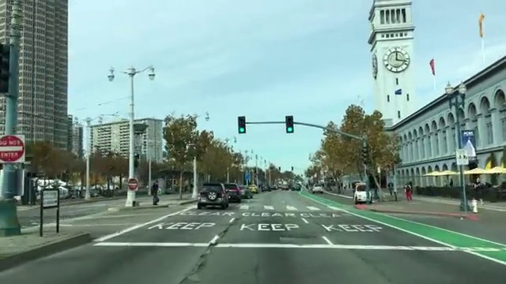
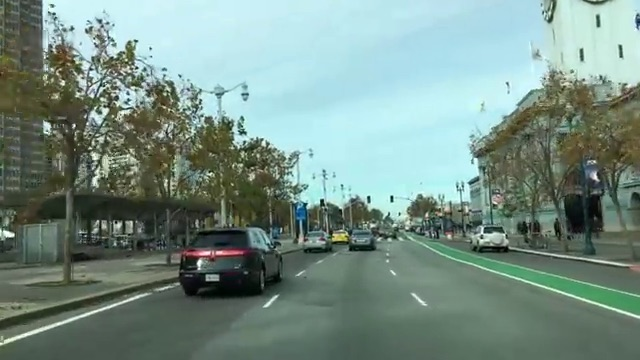

### "A street with tram tracks"

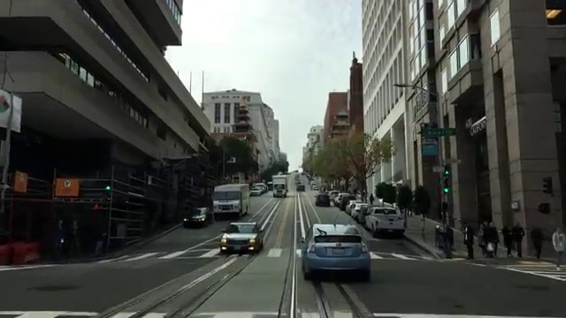
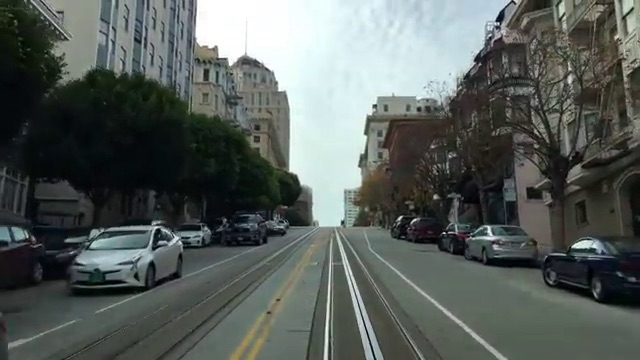
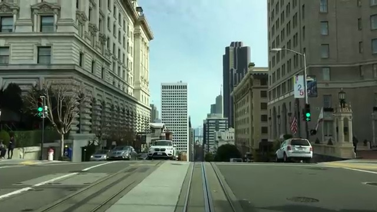

### "The Transamerica Pyramid"

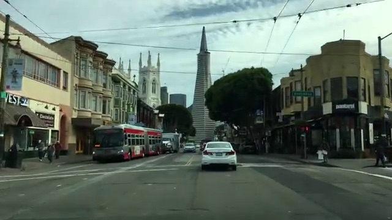

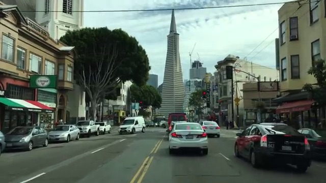

## Natural language search on Unsplah

You can also try my other project to search from 2M photos on [Unsplash](https://unsplash.com/) using natural language queries:

#### [Natural Language Image Search](https://github.com/haltakov/natural-language-image-search)
